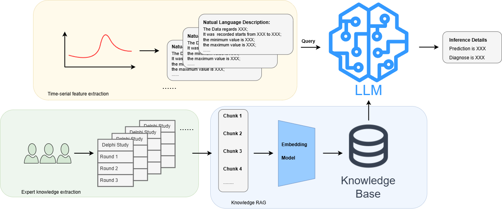
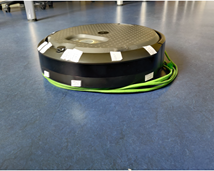
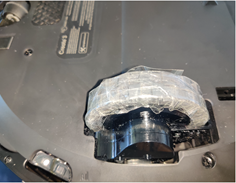
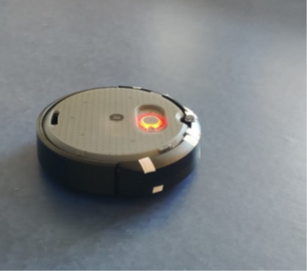

# Knowledge4LLM

Code and data for the paper:

**Enhancing LLM Inference with Human Expert Knowledge: A Case Study on Multi-Agent Robotics Fault Diagnosis and Prediction**

Knowledge4LLM evaluates how large language models (LLMs) can use structured maintenance knowledge for predictive maintenance (PdM) reasoning in a multi-robot case study. The repository includes the paper's retrieval-based LLM pipeline, evaluation scripts, and a deterministic knowledge-graph/rule reasoner (KG-R) baseline.

## What This Repository Shows

- Expert maintenance knowledge can improve LLM diagnostic answers.
- KG-R is strongest for explicit threshold and rule-based telemetry questions.
- LLMs and KG-R are complementary: KG-R provides traceable rule execution, while expert-grounded LLMs synthesize natural-language diagnostic explanations.
- The QA JSON files are evaluation sets only and are not used to extract rules.

## Pipeline

The pipeline follows the paper logic: expert/public documents are converted into a retrievable knowledge base, robot telemetry is summarized into engineered text descriptions, and LLMs answer diagnostic questions with or without retrieved knowledge.



## Robot Fault Scenarios

The telemetry-description tasks are based on observed robot maintenance scenarios.

| Object underneath | Wheel entanglement | Extreme battery depletion |
|---|---|---|
|  |  |  |

## Evaluation Tasks

| Task set | File | Size | Purpose |
|---|---:|---:|---|
| Basic knowledge queries | `docs/test_QA.json` | 61 | Single knowledge-point lookup and short diagnostic facts |
| Complex diagnostic queries | `docs/infere_QA.json` | 20 | Multi-hop reasoning over causes, effects, topics, and maintenance implications |
| Telemetry-description queries | `docs/data_QA.json` | 11 | Reasoning over engineered time-series summaries and threshold-like maintenance rules |

## Main Results from the Paper

### Basic Knowledge Tasks

With retrieved expert knowledge, Qwen reaches the best recall and human acceptability, while KG-R gives the highest precision because its answers are constrained to encoded graph facts.

| Setting | Method | Precision | Recall | LLMScore | HumanEval |
|---|---|---:|---:|---:|---:|
| Expert knowledge | DS-r1 | 0.067 | 0.565 | 0.795 | 0.672 |
| Expert knowledge | Llama | 0.285 | 0.644 | 0.857 | 0.803 |
| Expert knowledge | Gemma | 0.385 | 0.689 | 0.860 | 0.852 |
| Expert knowledge | Qwen | 0.369 | **0.819** | **0.890** | **0.934** |
| Expert knowledge | KG-R | **0.582** | 0.652 | 0.742 | 0.689 |
| No expert context | DS-r1 | 0.021 | **0.250** | **0.710** | 0.190 |
| No expert context | Llama | 0.014 | 0.122 | 0.464 | 0.148 |
| No expert context | Gemma | 0.048 | 0.110 | 0.430 | 0.230 |
| No expert context | Qwen | 0.047 | 0.231 | 0.601 | **0.295** |
| Public-document KG-R | KG-R | **0.212** | 0.247 | 0.391 | **0.295** |

### Complex Diagnostic Tasks

Complex questions favor semantic synthesis. KG-R remains precise, but larger LLMs are better at producing acceptable multi-part explanations.

| Method | Precision | Recall | LLMScore | HumanEval |
|---|---:|---:|---:|---:|
| DS-r1 | 0.163 | **0.486** | 0.878 | 0.600 |
| Llama | 0.350 | 0.384 | 0.881 | 0.725 |
| Gemma | 0.318 | 0.231 | 0.863 | 0.700 |
| Qwen | 0.306 | 0.424 | **0.897** | **0.900** |
| KG-R | **0.501** | 0.383 | 0.733 | 0.450 |

### Telemetry-Description Tasks

For threshold-driven telemetry summaries, KG-R is the strongest method because the decision boundary can be encoded as explicit rules.

| Method | Precision | Recall | LLMScore | HumanEval |
|---|---:|---:|---:|---:|
| DS-r1 | 0.190 | 0.294 | 0.834 | 0.500 |
| Llama | 0.281 | 0.331 | 0.646 | 0.600 |
| Gemma | 0.365 | 0.218 | 0.667 | 0.600 |
| Qwen | 0.354 | 0.401 | 0.895 | 0.682 |
| KG-R | **0.970** | **0.956** | **0.970** | **1.000** |

## Repository Layout

```text
Knowledge4LLM/
|-- docs/                         # Knowledge files, QA sets, and README images
|-- knowledge_base/               # Generated vector knowledge base, ignored by git
|-- evaluation_results/           # Generated evaluation outputs, ignored by git
|-- src/
|   |-- utils/                    # Shared text, embedding, and evaluation utilities
|   |-- data_loader.py            # Converts raw robot data into text summaries
|   |-- knowledge_loader.py       # Builds the vector knowledge base from docs/*.txt
|   |-- main.py                   # Interactive RAG-based LLM query demo
|   |-- evaluation.py             # Expert-grounded LLM evaluation
|   |-- evaluation_llm.py         # LLM-only or alternative LLM evaluation
|   |-- evaluation_graph.py       # GraphRAG-style retrieval evaluation
|   |-- grapgRAG.py               # GraphRAG knowledge-base builder
|   |-- rule_based_baseline.py    # Telemetry threshold baseline for data_QA
|   |-- symbolic_reasoner.py      # KG-R baseline for QA and telemetry tasks
|   `-- run_pipeline.py           # Unified CLI organized by the paper logic
`-- run_pipeline.py               # Thin compatibility wrapper for src.run_pipeline
```

## Data Roles

`docs/*.txt` files are knowledge sources. They are used to build the retrieval knowledge base and symbolic rules.

`docs/test_QA.json`, `docs/infere_QA.json`, and `docs/data_QA.json` are evaluation sets only. They must not be used to extract rules or build the knowledge base.

Main knowledge-source groups:

- Expert maintenance knowledge: `robot_knowledges_en.txt`, `robot_knowledges_de.txt`, `robot_knowledge_maintenance.txt`
- Public iRobot documentation: `iRobot_web_*.txt`
- Engineered telemetry descriptions: `time_series_features.txt` and QA descriptions in `data_QA.json`

## Requirements

- Python 3.10+
- Ollama with the required LLMs and embedding model installed
- Python packages: `numpy`, `pandas`, `scikit-learn`, `networkx`, `sentence-transformers`, `matplotlib`

The default embedding model is `nomic-embed-text`.

## Quick Start

Run commands from the `Knowledge4LLM/` directory.

```bash
cd Knowledge4LLM
```

Build the vector knowledge base:

```bash
python -m src.run_pipeline build-vector-kb
```

Run an interactive expert-grounded query:

```bash
python -m src.run_pipeline chat
```

Evaluate the expert-grounded LLM pipeline:

```bash
python -m src.run_pipeline evaluate-rag
python -m src.run_pipeline evaluate-rag --data
```

Evaluate LLM-only inference:

```bash
python -m src.run_pipeline evaluate-llm
python -m src.run_pipeline evaluate-llm --data
```

Evaluate the expert-knowledge KG-R baseline:

```bash
python -m src.run_pipeline evaluate-symbolic --test-file test_QA
python -m src.run_pipeline evaluate-symbolic --test-file infere_QA
python -m src.run_pipeline evaluate-symbolic --test-file data_QA
```

Evaluate the public-document KG-R variant without expert knowledge:

```bash
python -m src.run_pipeline evaluate-symbolic --knowledge-mode public --test-file test_QA
python -m src.run_pipeline evaluate-symbolic --knowledge-mode public --test-file infere_QA
python -m src.run_pipeline evaluate-symbolic --knowledge-mode public --test-file data_QA
```

Run all KG-R table evaluations:

```bash
python -m src.run_pipeline evaluate-all-symbolic
```

The root wrapper also works:

```bash
python run_pipeline.py evaluate-symbolic --test-file data_QA
```

## Method Notes

- The LLM pipeline reasons over retrieved text knowledge and engineered telemetry summaries.
- It does not directly model raw time-series dynamics.
- KG-R is deterministic and uses rules derived from text knowledge files, not from QA JSON files.
- The public-document graph estimates performance when expert maintenance knowledge is unavailable.
- Generated files in `knowledge_base/`, `evaluation_results/`, `embeddings/`, and `labeled_data/` are ignored by git.
